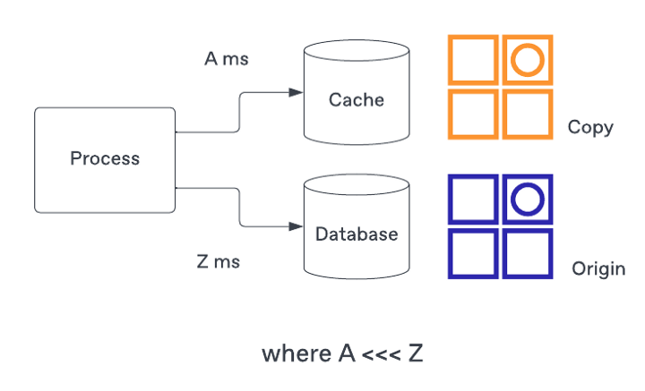
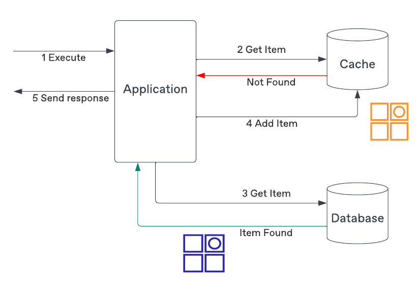
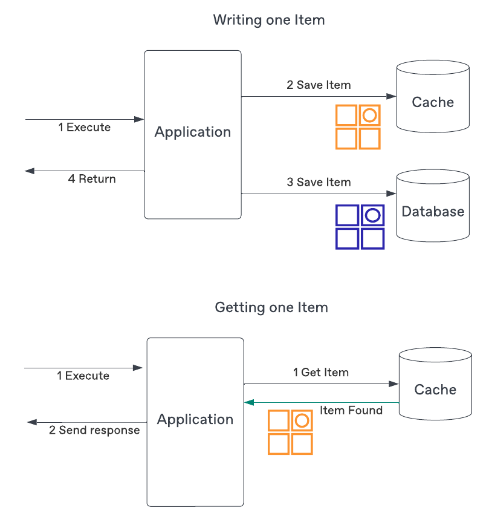
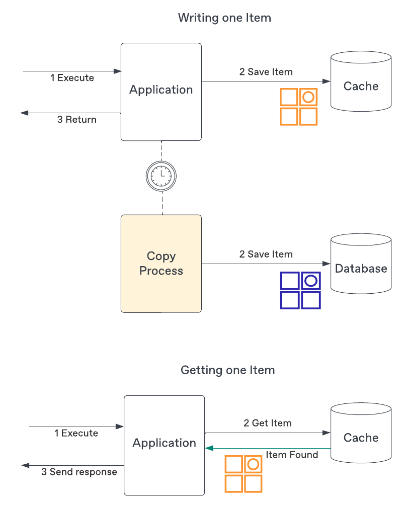

# Cache me if you can: A Look at Common Caching Strategies, and how CQRS can Replace the Need in the First Place

> Source: <https://medium.com/ssense-tech/cache-me-if-you-can-a-look-at-common-caching-strategies-and-how-cqrs-can-replace-the-need-in-the-65ec2b76e9e>

## It’s (Almost) all About Latency

Low latency requests are a standard non-functional requirement.
The way reduce latency is adding the cached - a copy of data - that can be retrieved significantly faster than if we attempted to do the same from the origin.

*The cache holds a copy of the data where the access is much faster than the origin.*

Caching appear in the network infrastructure used to serve the web pages (Ex: [CDN reliability and redundancy](https://www.cloudflare.com/en-gb/learning/cdn/cdn-load-balance-reliability/))

## When is Caching Beneficial?

Before deciding to add a cache make sure to actually consider if your application needs one. Customer-facing applications are usually more sensitive than server-to-server needs.

Traditionally, the need for caching your response being the result of a query that executes multiple joins behind the scenes. It takes time before delivering the response back to the client. Having a quickly accessible pre-joined result is nesscessary for high load system.

Before implementing a cache in the development of your application, you need analys that you do not need a cache or not. For example, if your application is not sending information back to someone who is browsing your e-commerce website, it may not matter if it takes 10 or 100 milliseconds to process your request.

## Common Caching Strategies

### Read-Through Caching

In this approach, your application will first attempt to read from your cache. If the requested information is not found it will fetch from the original source, add that information to the cache, and then return to the client..

You don't need to cache all data to fit in the cache and you may have an [eviction strategy](https://redis.io/docs/manual/eviction/) to remove entries that are too old and possibly outdated, or are not as frequently accessed and can be removed in order to save space (LRU, LFU, etc.).

### Write-Through Caching

Auto update cache when write to the origin.

This strategy will keep the cache in sync with the origin, and remove stale data, but comes with two additional costs:

- Your cache needs to save the entire data set. If most of the data is never read, cache will unnecessarily host useless data.

- Your writes will be slower and more complex as they need to write to both persistence solutions and potential failures of one of them ie. writing to the origin succeeds but writing to the cache fails.

### Write-Behind Caching

The final strategy write-behind flips the `source of truth` (SOT) to the cache.

Similarly to the write-through, the cache must be able to hold the entire data set, but the SOT is temporarily the cache and eventually makes its way toward the origin. Because the information is first written to the cache, it is always up-to-date and retrieval will always return the information with low(er) latency.

Unfortunately, there are two complexities with this solution:

- The cache must be resilient to make sure it does not lose any information prior to it making its way to the origin.

- There is an additional sync process to be developed and maintained.
