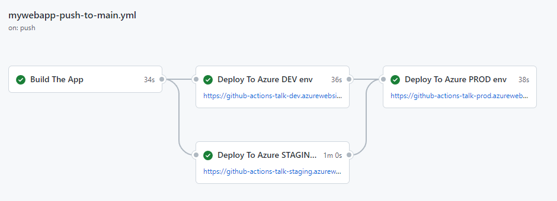

# 6 strategic ways to level up your CI/CD pipeline

> _Source: [6 strategic ways to level up your CI/CD pipeline](https://github.blog/2022-07-19-6-strategic-ways-to-level-up-your-ci-cd-pipeline/).

## 1. Add performance, device compatibility, and accessibility testing

Các bài test về hiệu năng, khả năng tương thích thiết bị và khả năng truy cập có một số team chỉ có
thể thực hiện được 1 phần. Việc test thủ công cho những vấn để ở trên có thể làm chậm quá trình
delivery nên nhiều team không thực hiện.

Nhưng nếu những việc này quan trọng đối với project thì nên sử dụng những tool tự động thực hiện
việc testing vào CI/CD pipeline để phát hiện ra lỗi.

### Performance and device compatibility testing

Có thể sử dụng những tool giúp mình thực hiện việc này. Ví dụ
[Playwright](https://github.com/microsoft/playwright). Tool này giúp thực hiện end-to-end testing,
automated testing, vv.. Có thể dùng nó để UI testing cho sản phẩm.

### Visual regression testing

Có nhiều tool hỗ trợ việc test tự động visual regression testing để đảm bảo là mình không thay đổi
UI khi chưa làm vậy. Nó giúp mình kiểm tra luôn tính tương thích thiết bị. Nếu có lỗi trên một thiết
bị nào đó thì mình có thể sửa nó một cách nhanh chóng. Ví dụ [Pa11y](https://github.com/pa11y/pa11y)
là một tool có thể chạy automated accessibility test thông qua command line hoặc Node.js.

### Accessibility testing

Là một loại automation test cần thêm vào CI/CD pipeline. Vì mỗi một user đều có giá trị với bạn.

## 2. Incorporate more automated security testing

Security luôn là một phần thiết yếu trong delivery pipeline. Có nhiều team trong các công ty không
kết hợp các bài test bảo mật trong CI/CD pipeline mà coi đó là việc cần sau khi quá trong DevOps
hoạt động xong.

Có rất nhiều tool giúp bạn làm việc đó mà không tốn quá nhiều sức lực bao gồm: GitHub-native tools
[Dependabot](https://docs.github.com/en/code-security/dependabot/dependabot-security-updates/configuring-dependabot-security-updates),
[code scanning](https://docs.github.com/en/code-security/code-scanning/automatically-scanning-your-code-for-vulnerabilities-and-errors/about-code-scanning-with-codeql),
[secret scanning](https://docs.github.com/en/code-security/secret-scanning/about-secret-scanning).
Nếu bạn sử dụng GitHub Enterprise thì có thể tham khảo thêm
[GitHub Advanced Security](https://docs.github.com/en/get-started/learning-about-github/about-github-advanced-security).

Nhiều developer không update dependencies của project vì nhiều lý do, có thể là tốn thời gian hoặc
là quên. Các lỗ hổng bảo mật từ các thư viện dependencies rất nghiêm trọng nhưng thường bị bỏ qua.

Ngoải ra, Github platform có cung cấp các công cụ scan code và secret để tăng tính bảo mật cho
project. Code scanning cung cấp Static Application Security Testing (SAST) cho biêt được repository
có chưa các lỗ hổng hoặc credentials hay không.

Điều quan trọng nhất là các team nên coi việc bảo mật là việc nên làm trong suốt vòng đời phát triển
sản phầm (Software Development Life Cycle - SDLC) - không chỉ trước và sau khi lên production.

_Automated security testing workflows on GitHub._

## 3. Build a phased testing strategy

Giai đoạn testing là một giai đoạn quan trọng đảm bảo việc có thể cung cấp phần mềm bảo mật nhanh
chóng trên quy mô lớn. Vì việc này tốn thời gian nên nhiều team không làm nó.

Có nhiều team bỏ hết các phần automated testing vào trong quá trình build trên CI/CD pipeline nên nó
mất rất nhiều thời gian để có được phản hồi về code của mình. Khi build phase testing thì nên build
những bài test nhanh và cơ bản nhất như unit test. Sau đó, bạn có thể deploy nó lên môi trường
testing và chạy những bài test tiếp theo như accessibility testing, user testing. Càng tới bước lên
production thì bạn sẽ muốn test nhiều hơn lúc này ta sẽ thực hiện regression testing để đảm bảo
những lỗi trước đó không còn lặp lại trên codebase. Tới bước này thì sẽ ít gặp lỗi hơn. Nhưng mục
đính bạn muốn tìm những lỗi hay vấn đề lớn trước sau đó thu hẹp dần các bài test xuống và đám bảo
chất lượng phần mềm.

## 4. Invest in blue-green deployments for easier rollouts

Blue-green deployment là một cách cải thiện việc roll out một phiên bản phần mềm mới trong CI/CD
pipeline, nhưng nó cũng khá phức tạp.

Blue-green deployment là cách triển khai hai hoặc nhiều version của phần mềm trên production và từ
từ chuyển số người dùng từ version cũ sang version mới.

Ưu điểm của cách làm này là có thể roll back bằng các chuyển user từ version này sang version khác.
Nó cũng giảm thiểu downtime khi triển khải vesion mới. Bạn chỉ cần tạo một môi trường mới và routing
người dùng sang môi trường mới.

Blue-green sẽ hoàn hảo hơn khi bạn có hai môi trường có thể hoán đổi cho nhau. Bạn có thể sử dụng
load balancer để routing traffic. Ngoài ra cách này còn có thể thấy trong Kubernetes. Khi bạn đang
có 1 số lượng các pod đang chạy và bạn thực hiện deploy thì kubernetes sẽ deploy một pod mới lên
trước và sẽ đẩy traffic qua rồi mới tắt pod cũ đi. Cơ chế này tuoinwg tự như blue-green deployment

## 5. Adopt infrastructure-as-code for greater flexibility

Nên xây dựng một hệ thống Infrastructure-as-code (IaC) trong CI/CD pipeline để delivery resouce một
cách tự động. Có nghĩa là khi deploy application thì cũng sẽ deploy infratructure. Điều này giúp
mình hình dung được môi trường production như thế nào và môi trường testing sẽ replica với production.

Có 2 lợi ít của việc build CI/CD pipeline:

1. Nó giúp bạn đảm bảo ứng dụng của bạn và hạ tầng thường xuyên được kiểm tra và môi trường testing sẽ gần nhất với production

2. Giúp giảm thiểu vấn đề khi gặp sự cố. Chỉ cần deploy lại vì mọi thứ đều tự động

## 6. Create checkpoints for automated rollbacks

Khi bạn cần roll back về một bản release version trước đó, việc set up được pipeline tự động sẽ làm mọi thứ dễ hơn.
Nếu bạn có một CI/CD pipeline đủ mạnh, bạn có thể sửa lỗi và triển khai update nhanh chóng và tránh phải roll back về một version trước.