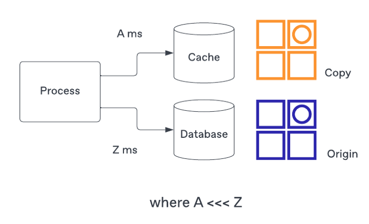
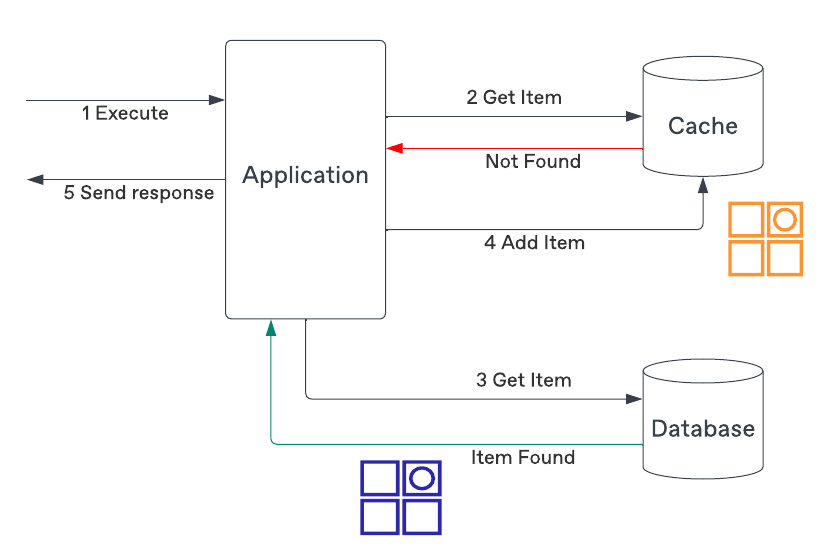
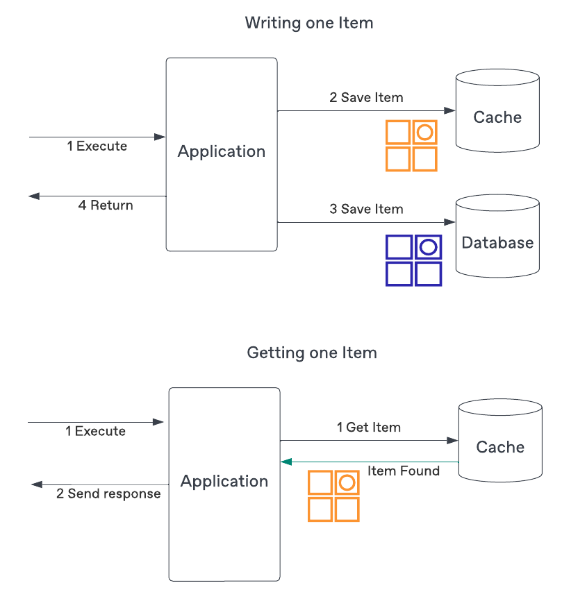
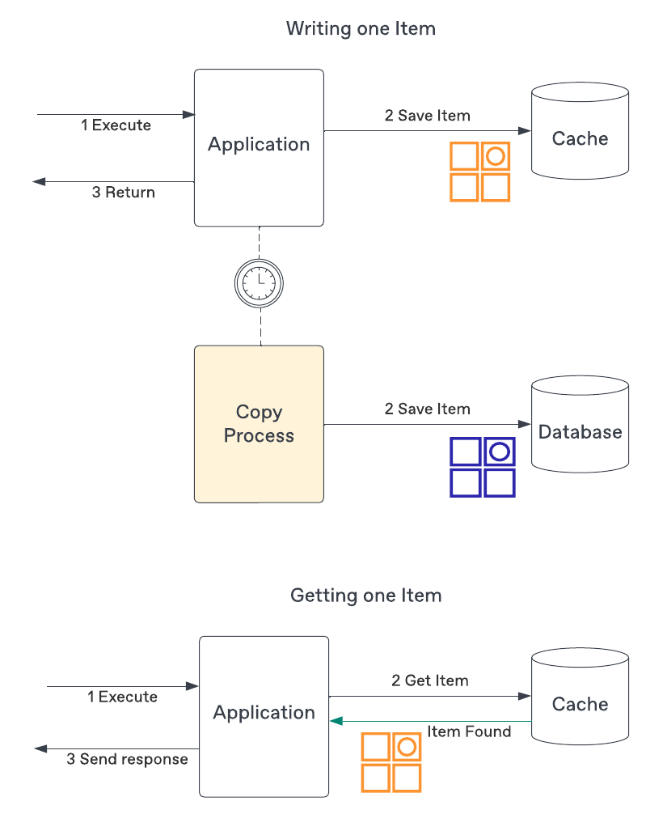
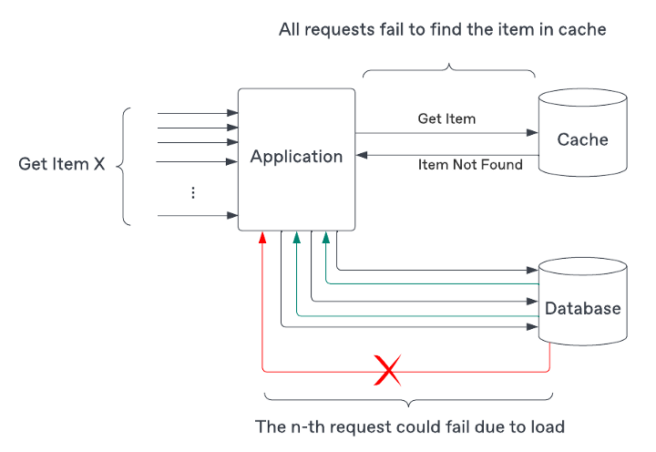
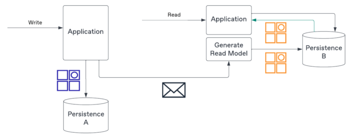
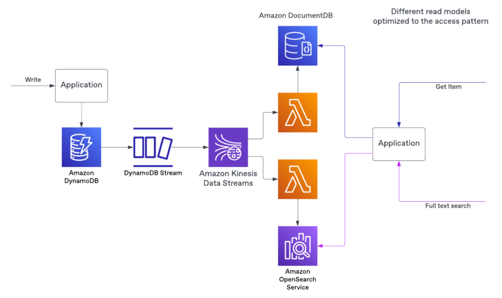

# Cache me if you can: A Look at Common Caching Strategies, and how CQRS can Replace the Need in the First Place

> Source: https://medium.com/ssense-tech/cache-me-if-you-can-a-look-at-common-caching-strategies-and-how-cqrs-can-replace-the-need-in-the-65ec2b76e9e

## It’s (Almost) all About Latency

Low latency requests are a standard non-functional requirement. The way reduce latency is adding the cached - a copy of data - that can be retrieved significantly faster than if we attempted to do the same from the origin.

*The cache holds a copy of the data where the access is much faster than the origin.*

Caching appear in the network infrastructure used to serve the web pages (Ex: [CDN reliability and redundancy](https://www.cloudflare.com/en-gb/learning/cdn/cdn-load-balance-reliability/))

## When is Caching Beneficial?

Before deciding to add a cache make sure to actually consider if your application needs one. Customer-facing applications are usually more sensitive than server-to-server needs.

Traditionally, the need for caching your response being the result of a query that executes multiple joins behind the scenes. It takes time before delivering the response back to the client. Having a quickly accessible pre-joined result is nesscessary for high load system.

Before implementing a cache in the development of your application, you need analys that you do not need a cache or not. For example, if your application is not sending information back to someone who is browsing your e-commerce website, it may not matter if it takes 10 or 100 milliseconds to process your request.

## Common Caching Strategies

### Read-Through Caching

In this approach, your application will first attempt to read from your cache. If the requested information is not found it will fetch from the original source, add that information to the cache, and then return to the client..

You don't need to cache all data to fit in the cache and you may have an [eviction strategy](https://redis.io/docs/manual/eviction/) to remove entries that are too old and possibly outdated, or are not as frequently accessed and can be removed in order to save space (LRU, LFU, etc.).

### Write-Through Caching

Auto update cache when write to the origin.

This strategy will keep the cache in sync with the origin, and remove stale data, but comes with two additional costs:

- Your cache needs to save the entire data set. If most of the data is never read, cache will unnecessarily host useless data.

- Your writes will be slower and more complex as they need to write to both persistence solutions and potential failures of one of them ie. writing to the origin succeeds but writing to the cache fails.

### Write-Behind Caching

The final strategy write-behind flips the `source of truth` (SOT) to the cache.

Similarly to the write-through, the cache must be able to hold the entire data set, but the SOT is temporarily the cache and eventually makes its way toward the origin. Because the information is first written to the cache, it is always up-to-date and retrieval will always return the information with low(er) latency.

Unfortunately, there are two complexities with this solution:

- The cache must be resilient to make sure it does not lose any information prior to it making its way to the origin.

- There is an additional sync process to be developed and maintained.

### Why Adding a Cache is a Non-Trivial Task

Adding cache simplify reduce read-through strategy. In reality, you will encounter several details that make even the most straightforward approach error-prone. Let’s look at the often overlooked pitfalls.

#### Stale Data

For an application to use caching, it must already accept that it will serve potentially outdated information. 

The simplest approach is to set a time to live (TTL). After that time the data found in a cache is to be ignored or delete from cached. That’s great but what value should you put it at? 5 seconds? 5 minutes?

If you set TTL value too big, the information in the origin may have changed and you’ll be sending outdated information to clients. If you put it too small most number of requests can not get data from cached. In the end, your application context should dictate the TTL you select.

#### Cache Stampede

Imagine that when we try to get data from cached and not found it, we need to request the origin to get data. Nothing out of the ordinary, but there are hundred of requests arriving almost the same time (the cache data haven't updated yet). After that they trigger request to the origin and increase the database throughput.

So we can lock the access so only one request will actually trigger the access to the origin, to preemptively making sure an item is found in the cache prior to enabling any traffic to the origin.

### Why CQRS can be your Cache

Command Query Responsibility Segregation is a pattern that a query is an action that does not mutate the state while a command does. Additionally, although not mandatory, CQRS implementations leverage different persistence solutions  between the query and command sides.

*A simple example of CQRS with two different persistence used for write and read operations.*

One reason is that the writing side is where to ensure the business rules are respected. The read side, on the other hand, may just require a (subset) of the entity and no logic to guard changes.

The write side will emit messages — events — representing the state changes that resulted from a command. You will use those messages to create and maintain the read side.

*Sample implementation leveraging AWS services to stream events and build one or more read models.*

Because the read side has no require to match the write side on the technology to use, you can select one that addresses the latency requirements.

So let’s recap the properties commonly found in a cache:

- Cached data is eventually consistent with the origin
- Provides a pre-computed result
- Satisfies a read-only pattern with low(er) latency requirements

With CQRS we end up with a solution that matches all the above, with a couple of advantages:

- Contrary to most cache implementations, CQRS is not an afterthought but rather planned from the beginning
- The read side can be simple as there is no need for repositories or manipulating entities. Simple data transfer objects (DTOs) can be used to represent the data.

### Conclusion

Caching is a ubiquitous pattern used in application development. The typical cycle is to develop your application, deploy it, and after some time find out that you have to add a cache because your application can’t cope with demand.

On the surface, it may look like a trivial task, but managing TTLs and handling stampedes are two of the most overlooked complexities that you should factor in when deciding to add a cache.

Alternatively, if you are already developing an event-drive application (EDA), a potential solution instead of adding a cache is to leverage a CQRS pattern as it will make use of the already existing event approach and infrastructure to deliver the desired outcome from the get-go.

Finally, remember to challenge if your application really benefits from a specific low latency operation. Faster is often better but the cost to achieve it may be steep. No matter what solution you choose, make sure to distinguish between the desire to have caching and a truly advantageous use case where the effort required to implement caching has significant improvements on your application.
