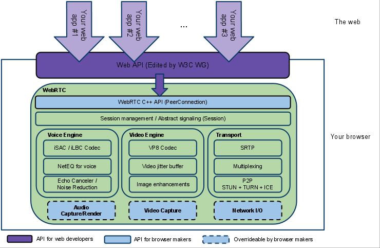

# WebRTC

## 1. Giới thiệu

WebRTC là viết tắt của cụm từ Web Real-Time Communication rất được các lập trình viên ưa chuộng. WebRTC cho phép các trình duyệt giao tiếp với nhau theo thời gian thực .Ví dụ như: gọi điện, video, chơi game,… Ngoài ra, WebRTC là một sản phẩm của World Wide Web Consortium (W3C).

WebRTC là các API viết bằng javascript giúp giao tiếp theo thời gian thực. WebRTC có khả năng hỗ trợ trình duyệt giao tiếp thời gian thực thông qua Video Call, Voice Call hay transfer data P2P(peer-to-peer).

## 2. Công dụng của WebRTC

Truyền tải video, âm thanh, gửi dữ liệu “Peer-to-Peer” (P2P) theo thời gian thực giữa hai hay nhiều thiết bị mà không qua trung gian, không cần cài thêm plugin.

Phát triển game chơi trực tiếp trong trình duyệt. Người chơi chỉ cần sử dụng trình duyệt có hỗ trợ WebRTC để chơi, không cần cài đặt rườm rà.

## 3. Kiến trúc

Kiến trúc tổng quan gồm 2 lớp riêng biệt:

- Browser developers sẽ quan tâm đến WebRTC C++ API và các thành phần core sâu hơn của nó như Voice Engine, Video Engine, Transport. Hay dễ hiểu hơn đó là âm thanh, video và kết nối mạng.

- Web App developers sẽ quan tâm tới Web API.

**Your Web App**

Một ứng dụng phát triển bởi các developer bên thứ 3 với video và audio chat, xây dựng dựa trên Web API để kết nối thời gian thực.

**Web API**

Một API được sử dụng bởi các developer bên thứ 3, để phát triển web video.

WebRTC Native C++ API

Một tầng API cho phép trình duyện dễ dàng thực thi Web API.

**Transport / Session**

Các session componnent được xây dựng bời việc sử dụng lại các component từ libjingle, không yêu cầu hoặc sử dụng giao thức xmpp/jingle .

**RTP Stack**

Một network stack cho RTP (Real Time Protocol)

**STUN/ICE**

Một component cho phép các cuộc gọi sử dụng STUN và ICE để thiết lập kết nối thông qua các loại networks khác nhau.

**Session Management**

Một lớp session trừu tượng (abstract session layer) cho phép thiết lập cuộc gọi và lớp quản lý.

**VoiceEngine**

VoiceEngine là một framework cho audio media chain, từ card âm thanh tới mạng.

**iSAC / iLBC / Opus**

Đây là những audio codec, đơn giản hiểu là cách mình nén và giải nén data audio và video để truyền tới user phù hợp với bandwidth và chất lượng âm thanh, hình ảnh đầu đầu ra.

- iSAC: Một băng tần rộng (wideband) và băng tần siêu rộng (super wideband) audio codec cho VoIP và streaming audio. iSAC sử dụng tần số 16 kHz hoặc 32 kHz ví dụ thường xuyên với một adaptive và biến bit rate của 12 - 52kbps. Codec là một thiết bị hoặc một chương trình máy tính có khả năng mã hóa và giải mã một dòng dữ liệu hoặc tín hiệu. Từ "codec" là từ kết hợp của bất kỳ những cụm từ sau: 'Compressor-Decompressor', 'Coder-Decoder', hoặc 'Compression/Decompression algorithm'. Các codec mã hóa một dòng dữ liệu hoặc tín hiệu để truyền tải, lưu trữ, hoặc bảo mật và giải mã nó để xem hoặc sửa đổi. Các codec thường được sử dụng trong các giải pháp hội nghị truyền hình và streaming media. Một máy quay biến đổi tín hiệu tuần tự sang tín hiệu số, sau đó sẽ chuyển qua một bộ nén video để truyền tải tín hiệu số. Một thiết bị nhận sẽ chuyển tín hiệu qua một bộ giải nén video, sau đó một thiết bị biến đổi từ tín hiệu số sang tín hiệu tuần tự để thể hiện nội dung. Một bộ giải nén âm thanh sẽ biến đổi tín hiệu âm thanh tuần tự sang tín hiệu số để truyền tải. Một thiết bị nhận sẽ biến đổ tín hiệu số trở lại tín hiệu tuần tự thông qua một bộ giải nén âm thanh để phát lại nội dung.

- iLBC: Một narrowband speech codec cho VoIP và streaming audio. Sử dụng tần số 8 kHz với một bitrate of 15.2 kbps cho 20ms khung và 13.33 kbps cho 30ms khung. Định nghĩa bởi IETF RFCs 3951 và 3952.

- Opus: hỗ trợ hằng và biến bitrate mã hóa từ 6 kbit/s tới 510 kbit/s, khung size từ 2.5 ms tới 60 ms. Được định nghĩa bởi IETF RFC 6176. NetEQ cho Voice.

**Acoustic Echo Canceler (AEC)**

The Acoustic Echo Canceler là một phần mềm dựa trên các thành phẫn xử lý tín hiệu đã được xóa. Trong real time, acoustic cho kết quả từ voice được chạy tới mircrophone đang hoạt động

**Noise Reduction (NR)**

Noise Reduction component là một phần mềm dựa trên các thành phần xử lý tín hiệu, nhằm loại bỏ các loại tiếng ồn kết hợp với VoIP. (Hiss, fan noise, etc…)

**VideoEngine**

VideoEngine là một framework video media chain cho video, từ camera tới mạng, và từ mạng tới màn hình.

**VP8**

Video codec từ dự án WebM. Nó phù hợp với RTC như một thiết kế cho độ trễ thấp (low latency)

**Video Jitter Buffer**

Jitter Buffer động cho video. Giúp che giấu ảnh hưởng của jitter và packet bị mất trong toàn bộ chất lượng video.

**Image enhancements**

Ví dụ như xóa tiếng ồn video từ ảnh quay bởi webcam.

## 4/ Cách hoạt động

### 4.1/ Các bước thực hiện

- Sử dụng getUserMedia API để truy cập vào camera và microphone.

- Lấy thông tin network như địa chỉ IP, ports và trao đổi thông tin đó với các peer khác (những peer mà mình muốn connect tới) để tạo connection (kết nối) dù cho có bị ngăn cản bởi NATs hay firewalls.

- Sau đó thì dùng RTCPeerConnection và RTCDataChannel để voice call/ video call hoặc chia sẻ dữ liệu sau khi đã có kết nối peer-to-peer.

## 4.2/ MediaStream

Một `MediaStream` đại diện cho sự đồng bộ dữ liệu âm thanh và hình ảnh. `MediaStream` được khởi tạo bằng cách gọi hàm getUserMedia (Web API) . Sau khi một kết nối WebRTC tới một máy tính khác được thiết lập, chúng ta có khả năng truy cập vào stream của máy tính đó. Mỗi peer sẽ có một local media stream riêng.

Một `MediaStream` sẽ có input/output. Input là sẽ lấy những dữ liệu âm thanh và hình ảnh của local và output dùng để hiển thị lên view hoặc được RTCPeerConnection sử dụng

### 4.3/ Kết nối Peer to peer

Kết nối P2P của WebRTC là cách thức kết nối 2 ứng dụng ở 2 máy khác nhau. Khi kết nối thì chúg có thể truyển tải video, audio, binary data (nếu client đó hỗ trợ RTCDataChannel API). Để tạo được kết nối P2P giữa 2 client cần cung cấp cấu hình ICE (Internet Connectivity Establishment) Server. Bao gồm TURN hay STUN server có vai trò chuyển các cấu hình ICE candidates cho mỗi client để thực hiện peer connection. Cách chuyển các cấu hình ICE qua lại giữa các client được gọi là Signaling.

**NAT (Network Address Translation)**

- Có 2 loại IP là IP public và IP private, các máy trong mạng LAN được đặt IP Private vì mấy IP private không tồn tại ngoài Internet (Vd: 192.168.1.1, 192.168.1.2 etc). IP public thì tất nhiên tồn tại trên Internet rồi vì chùng ta đã đăng ký với ISP (nhà cung cấp dịch vụ Internet). Thông thường NAT thường thay đổi địa chỉ thường là địa chỉ riêng (IP Private) của một kết nối mạng thành địa chỉ công cộng (IP Public).

- Vậy khi A send B một gói tin với thông tin tóm lược như : IP nguồn (IP của A) : 192.168.1.1 , IP đích: (113.xxx.y.z)

- Bởi vì IP private không tồn tại ngoài Internet nên chúng ta cần NAT để thay thế IP private của A thành IP public.

- Ta có thể hiểu đơn giản là "NAT sử dụng IP của chính nó làm IP công cộng cho mỗi máy con (client) với IP riêng. Khi một máy con thực hiện kết nối hoặc gửi dữ liệu tới một máy tính nào đó trên internet, dữ liệu sẽ được gởi tới NAT, sau đó NAT sẽ thay thế địa chỉ IP gốc của máy con đó rồi gửi gói dữ liệu đi với địa chỉ IP của NAT. Máy tính từ xa hoặc máy tính nào đó trên internet khi nhận được tín hiệu sẽ gởi gói tin trở về cho NAT computer bởi vì chúng nghĩ rằng NAT computer là máy đã gởi những gói dữ liệu đi. NAT ghi lại bảng thông tin của những máy tính đã gởi những gói tin đi ra ngoài trên mỗi cổng dịch vụ và gởi những gói tin nhận được về đúng máy tính đó (client).

**STUN (Simple Traversal Of UDP Through NAT):**

- STUN có thể hiểu là khi một máy chủ nào xài NAT (behind NAT) thì STUN server sẽ giúp cho client đó biết được địa chỉ IP và Port mà thiết bị NAT sử dụng. Và từ đó giúp cho các peer có thể lấy được địa chỉ của peer khác (IP nào, cổng mấy, NAT loại gì).

- Nhưng STUN có một nhược điểm là nó không support Symmetric NAT (NAT có nhiều loại xem thêm), vì thế ta có TURN giúp khắc phục nhược điểm này

**TURN (Traversal Using NAT Relay):**

Cũng giống như STUN tuy nhiên TURN hỗi trợ cả giao thức TCP làm giao thức truyền tải. TURN bổ xung cho hạn chế của STUN là hỗ trợ Symmetric NAT. Dữ liệu thay vì được gửi trực tiếp tới các peer thì các peer sẽ gửi dữ liệu tới các TURN server và TURN server sẽ đóng vai trò trung gian vận chuyển gói tin. Điều này nâng cao giúp chất lượng dịch vụ của ứng dụng mà còn đảm bảo an toàn thông tin khi truyền dẫn.

**SDP (Session Description Protocol)**

Là một tiêu chuẩn để mô tả nội dung đa phương tiện của kết nối như độ phân giải, định dạng, codec, mã hóa, v.v. để cả hai client có thể hiểu nhau khi dữ liệu được truyền. Về bản chất, đây là siêu dữ liệu mô tả nội dung chứ không phải bản thân nội dung phương tiện.

**ICE**

- ICE nôm na dễ hiểu là một giao thức được cùng để thiết lập phiên media dựa trên UDP đi qua NAT một cách nhanh nhất.

- ICE sẽ tìm đường tốt nhất để kết nối giữa các peer, nó thử tất cả khả năng có thể kết nối một cách song song và lựa chọn con đường hiệu quả nhất (cướp ngân hàng làm giàu).

- Đầu tiên nó sẽ cố gắng tạo ra một kết nối bằng cách sử dụng địa chỉ thu được từ hệ điều hành và card mạng của thiết bị, nếu không thành công (có thể thiết bị đằng sau NAT) thì ICE sẽ lấy địa chỉ bên ngoài của thiết bị bằng cách sử dụng máy chủ STUN (nhưng đời có lúc không gặp may), nếu không thành công nữa thì nó sẽ chuyển lưu lượng mạng qua một máy chủ chuyển tiếp là TURN.

- Nếu khó nhớ thì các bạn cứ nghĩ là ICE xài STUN xong không được thì đi xài TURN.

**Signaling**

VÌ WebRTC là phương thức giao tiếp P2P giữa 2 client. Vậy làm sao để 2 client này có thể biết được nhau và tạo connection? WebRTC cung cấp một Signaling protocol để làm việc đó. Signaling là một process dùng để setting, controlling và terminating một communicate session. Để 2 client có thể giao tiếp được với nhau cần phải trao đổi 3 thông tin:

- Session controll information: xác định thời điểm tạo, đóng, thay đổi và report lỗi của session

- Network data: cung cấp thông tin endpoint (IP & port) của client gọi tới (callee) cho client gọi (caller)

- Media data: xác định codecs và media type giữa caller và callee. Các thông tin này phải giống nhau. Nếu khác thì sẽ không thể kết nối thành công

Có rất nhiều cách để tạo Signaling giữa 2 client như: WebSocket, Socket.io, XMPP (Extensible Messaging and Presence Protocol), SIP (session initiation protocol),Kurento, hoặc đơn giản hơn bằng XHR.

|           | Giới thiệu                                                                                                                                                              | Protocol           | Chuẩn giao tiếp                   | Thiết bị hỗ trợ                 | Ưu điểm                                                                                                                                      | Nhược điểm                                                                  |
| --------- | ----------------------------------------------------------------------------------------------------------------------------------------------------------------------- | ------------------ | --------------------------------- | ------------------------------- | -------------------------------------------------------------------------------------------------------------------------------------------- | --------------------------------------------------------------------------- |
| Websocket | Là 1 web API có trên browser.  Nó là một đặc tả mới của HTML5,  nên nó vẫn chưa được tất cả các trình duyệt hỗ trợ.                                                     | TCP                | String, buffered arrays và blobs. | Browser, mobile                 | Giao tiếp real time. Kiểm tra được user nào đang online                                                                                      | TCP socket nên tốn thời gian khởi tạo                                       |
| Socket.io | Là một thư viện viết dựa trên websocket.                                                                                                                                | TCP                | String, buffered arrays và blobs. | Browser, mobile                 | Giao tiếp real time. Kiểm tra được user nào đang online                                                                                      | TCP socket nên tốn thời gian khởi tạo. Performance không tốt bằng websocket |
| SIP       | là một giao thức báo hiệu được sử dụng để thiết lập  một phiên giao dịch trực tuyến giữa 2 hoặc nhiều người  tham gia, sửa đổi phiên đó và cuối cùng chấm dứt phiên đó. | TCP, UDP           | Text based như HTTP               | Browser, mobile, điện thoại bàn | Vì SIP là tiêu chuẩn mở nên nó tương thích với đa số các  thiết bị như: điện thoại bàn, tablets, laptop và nhiều  thiết bị khác              | Quá trình set up server SIP tốn thời  gian và chi phí                       |
| XMPP      | trước đây là Jabber, là giao thức mở và dựa trên nền tảng  XML dùng trong nhắn tin nhanh (instant messaging) và thông  tin hiện diện trực tuyến                         | TCP (native), HTTP | XML                               | Browser, mobile                 | Vì XMPP là một giao thức mở, bất kỳ ai cũng có thể có máy  chủ XMPP của riêng mình trong mạng mà không nhất thiết  phải kết nối với Internet | Nhắn tin dựa trên văn bản, không cung  cấp mã hóa đầu cuối                  |

## 5. Ưu nhược điểm

**Ưu điểm**

- Truyền tải data trực tiếp từ client tới client giảm thiểu gánh nặng cho server và latency

- Open source

- Dữ liệu media sẽ được mã hóa và xác thực nhờ giao thức SRTP (Secure Real-Time Transport Protocol). Nhờ vậy, trong quá trình thực hiện tác vụ video hay voice, bạn có thể yên tâm, không bị nghe trộm.

- Hỗ trợ lọc tiếng ồn và hỗ trợ các codec có sẵn.

- WebRTC hỗ trợ việc tích hợp với nhiều kiểu media và các thiết bị đầu cuối khác nhau. Nhờ vậy, các ứng dụng tương tác video hoặc gọi thoại của người dùng sử dụng băng thông hiệu quả hơn.Các APIs WebRTC và signaling có thể thỏa thuận kích thước và định dạng cho mỗi thiết bị đầu cuối.

- Nhờ tính năng video call, người dùng không phải tốn cước điện thoại cho mỗi cuộc gọi nữa.

**Nhược điểm**

- Tuỳ vào browser, các browser Google Chrome và Firefox support rất mạnh về WebRTC. Các browser Microsoft Edge, Safari phải cài thêm plugin

- Truyền tải theo protocol UDP dẫn tới dễ mất dữ liệu nên không thích hợp truyền tải file.

- Không có một standard signal protocol nào, nên sẽ phải tự triển khai các kết nối. Ví dụ: WebSocket, Socket.io, XMPP, SIP (session initiation protocol) hoặc đơn giản hơn bằng XHR

- WebRTC bị cản bởi NAT và tường lửa khi cố gắng thực hiện kết nối P2P.

- Không có cơ chế báo hiệu cài sẵn khi WebRTC tạo kết nối P2P giữa các trình duyệt.

- Các hãng trình duyệt chưa thống nhất được chuẩn video sử dụng cho WebRTC.

- Số lượng hàm API WebRTC hỗ trợ cho mỗi trình duyệt là khác nhau, tăng rủi ro phát sinh lỗi khi sử dụng trên các trình duyệt khác nhau.

## 6. Conclusion

WebRTC thích hợp cho việc tạo ứng dụng video call, audio call giảm tải cho server. Vì WebRTC viết trên giao thức UDP nên không thích hợp truyền file với yêu cầu tính toàn vẹn cao.

Bởi vì chỉ có thể gọi P2P nên không hỗ trợ việc call room hay stream video xuống cho nhiều đối tượng được. Nhưng ta có thể set up một Media WebRTC server để phục vụ việc này. Những software hỗ trợ việc tạo một Media WebRTC server như: Kurento, Licode, MediaSoup
