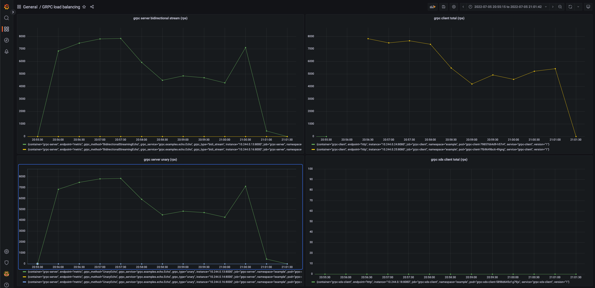
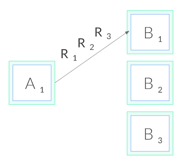
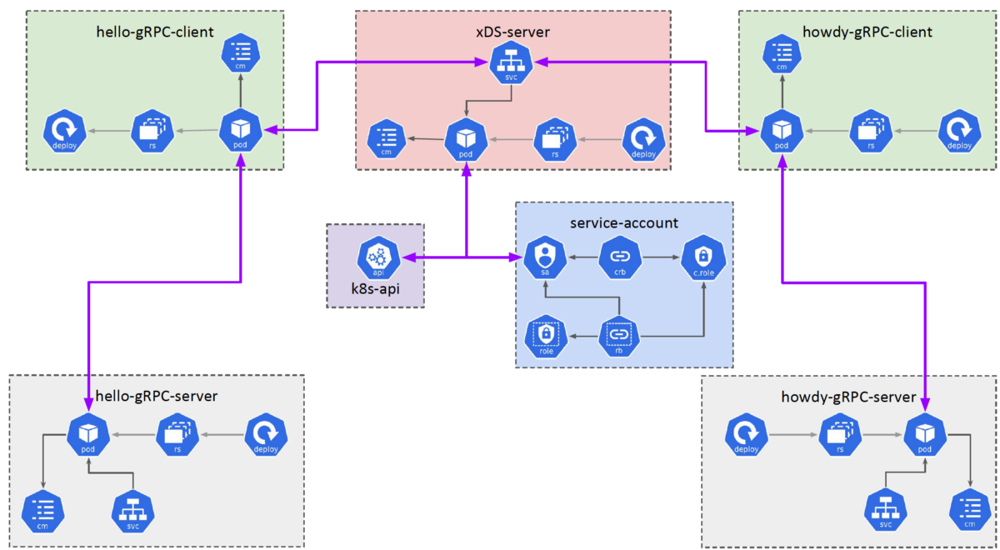
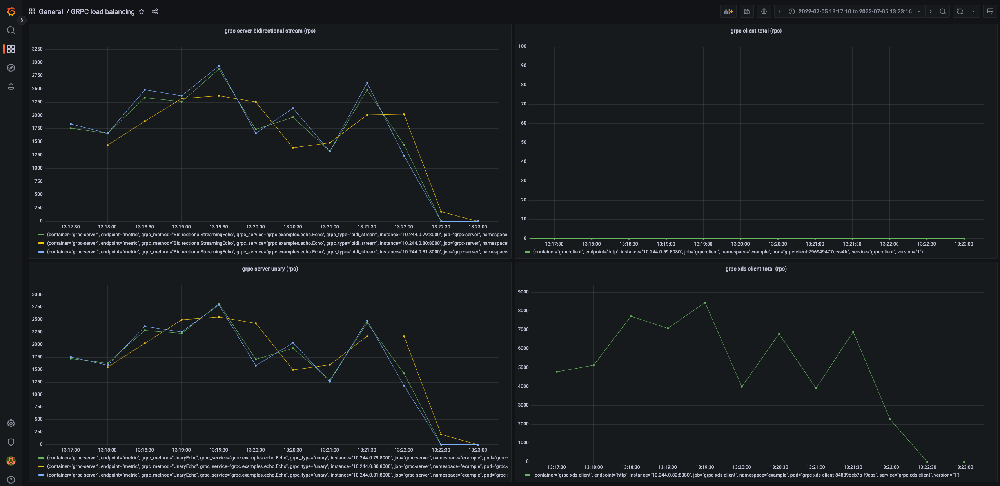

# GRPC load balancing in Kubernetes

> Khi viết các ứng dụng giao tiếp với nhau theo framework grpc và deploy lên Kubernetes. Để cấu hình cho client application
> gọi qua server application, ta thường thông qua service của Kubernetes và ta nghĩ rằng kubernetes service sẽ load
> balancing. Nhưng thực tế thì không như vậy.

## Nội dung

[1. Vấn đề](#problem)

[2. Tại sao service của kubernetes không thể cân bằng tải cho grpc?](#grpc-loadbalancing)

[3. Giải pháp](#solution)

[4. xDS là gì?](#xds)

[5. Ưu nhược điểm](#pros-cons)

<h3 id="problem">Vấn đề</h3>

Ta hãy thử cài đặt 1 ví dụ sau đây. [Grpc xds example](https://github.com/trinhdaiphuc/grpc-xds-example). Clone project vể và cài đặt
Kubernetes và Prometheus operator (có link cài đặt trong repo). Chạy grpc server và grpc client để gửi request tới grpc server thông qua
Kubernetes service. Ta chỉ cần chạy lệnh.

```bash
kubectl apply -f ./deploy/namespace.yml 
kubectl apply -f ./deploy/server.yml 
kubectl apply -f ./deploy/client.yml 
```

Ở đây grpc client sẽ gửi request liên tục trong 5 phút với 100 concurrency request (để tuỳ chỉnh cấu hình xem trong phần Configuration). Ví dụ này mình 
có tạo metrics cho các application để theo dõi số lương request client gửi đi và server nhận được. Chỉ cần bật Grafana service đã được cài trong 
Kubernetes lên và import dashboard vào để theo dõi. Và xem kết quả



Có tới 3 server mà chỉ có 1 server nhận được tất cả request. Restart grpc client và thử lại ta sẽ thấy cũng sẽ chỉ có 1 server nhận tất cả các request.

<h3 id="grpc-loadbalancing">Tại sao service của kubernetes không thể cân bằng tải cho grpc?</h3>

Việc này không phải do service mà là do cơ chế của grpc. Ta biết được grpc được build trên HTTP/2. HTTP/2 được thiết kế cho việc mở một
long-lived TCP connection và tất cả requests đều được gửi trong 1 connection và gửi liên tục suốt quá trình connection được mở (multiplex -
không bị Head-of-line blocking như HTTP/1). Vì vậy khi kết nối được tạo tới 1 server thì các request sẽ chỉ gửi theo connection đó nên sẽ
không load balance được.



<h3 id="solution">Giải pháp</h3>

Vì cơ chế khác với HTTP/1 ta cần sử dụng các cách [load balancing của grpc](https://grpc.io/blog/grpc-load-balancing/)

- Sử dụng proxy. Ta có thể sử dụng các proxy để load balancing cho grpc server như Envoy hoặc sử dụng Service mesh như: Istio, Linkerd, vv..
Cách này chỉ cần implement vào và sử dụng nhưng bị nhược điểm là thêm 1 lớp proxy làm giảm performance.

- Sử dụng cách client load balancing. Lúc này ta cần phải biết hết thông tin endpoint của server back end. Thật may grpc hỗ trợ một phương thức client 
load balancing là [xDS protocol](https://github.com/grpc/proposal/blob/master/A27-xds-global-load-balancing.md). gRPC sẽ chuyển từ giao thức `grpclb` ban đầu sang giao thức `xDS` mới.

<h3 id="xds">xDS là gì?</h3>

#### xDS API

Là bộ api của Envoy một discovery service cho phép ta cấu hình và lưu trữ các tài nguyên back end và cập nhật nó bằng cách sử dụng [Envoy control plane api](https://www.envoyproxy.io/docs/envoy/latest/start/quick-start/configuration-dynamic-control-plane).
Envoy cung cấp tính năng tách biệt [data plane](https://blog.envoyproxy.io/the-universal-data-plane-api-d15cec7a) ra khỏi phần control plane api.
Nên ta có thể sử dụng bộ data plane này để lưu lại những tài nguyên mà ta đã discovery được. Từ đó ta viết một server đọc vào Kubernetes api
để lấy các tài nguyên cần để load balancing và tạo các resource theo chuẩn cấu hình của Envoy và snapshot lại. Khi này các thông tin tài
nguyên sẽ được cung cấp cho Envoy (để cập nhật lại config khi các dynamic resource) hoặc grpc client có cài đặt xds protocol.

Bộ xDS API chính:

- Listener Discovery Service (LDS): Trả về `Listener` resources. Có thể hiểu là cấu hình domain cho back end server mà phía client cài đặt để lấy thông tin các các resource back end server.
- Route Discovery Service (RDS): Trả về `RouteConfiguration` resources. Cấu hình traffic shiftting.
- Cluster Discovery Service (CDS): Trả về `Cluster` resources. Cấu hình thuật toán load balancing.
- Endpoint Discovery Service (EDS): Trả về `ClusterLoadAssignment` resources. Cấu hình tập các endpoint của back end server để client kết nối và load balancer phía client.

Để viết một xDS server thì mình có viết mẫu trong ví dụ ở đầu bài. Mình sử dụng xDS gọi vào Kubernetes API để polling các resource theo mỗi
phút để lấy ra thông tin endpoint (ip, port) của các pod trong mỗi service cần thiết. Từ đó mình sẽ tạo các resource như ở trên và cập nhật
nó vào cache của data plane. Sau khi tạo snapshot và đánh version cho data plane, các thông tin này sẽ được gửi về cho phía client để client
thực hiện tạo thêm hay đóng connection để tiếp tục load balancing. Ví dụ



#### grpc client architecture


Để viết một load balancing custom trong grpc thì phải implement 2 plugin là [resolver](https://github.com/grpc/grpc/blob/master/doc/naming.md) và 
[LB policy](https://github.com/grpc/grpc/blob/master/doc/load-balancing.md). Thật may grpc đã implement sẵn 2 phương thức này cho xds. Nhưng để lấy được 
kết quả client sẽ gọi vào các api streaming của xDS server để gửi request bao gồm các back end server muốn kết nối và nhận lại các thông tin này liên 
tục khi chúng có thay đổi. Từ đó grpc client sẽ tạo connection tới các grpc server thông qua các thông tin cấu hình đó.

XdsClient và Bootstrap File

- Để bật tính năng xds protocol thì phía server back end không cần thay đổi gì hết, nhưng phía client sẽ phải implement thêm. Ví dụ với
Golang thì chỉ cần thêm dòng dưới vào file main. Tất cả các logic tương tác với xDS server đã được implement sẵn.

```golang
import _ "google.golang.org/grpc/xds"
```

- Sau đó ta phải tạo 1 file gọi là Bootrap file rồi ta cấu hình đường dẫn file đó vào trong biến môi trường `GRPC_XDS_BOOTSTRAP`

```json
{
    "xds_servers": [
    {
        // Service name của xDS server
        "server_uri": "grpc-xds-grpc.example.svc.cluster.local:18000",
        "channel_creds": [{"type": "insecure"}],
        "server_features": ["xds_v3"]
    }
    ],
    "node": {
        "id": "b7f9c818-fb46-43ca-8662-d3bdbcf7ec18",
        "metadata": {
            "R_GCP_PROJECT_NUMBER": "123456789012"
        }
    }
}
```

- Cuối cùng ta phải thay đổi uri address kết nối tới server thành xds:///<server_uri>. `server_uri` chính là domain mà ta cấu hình ở phía LDS.
Trong ví dụ khi tạo service cho 1 grpc server back end, mình sẽ lấy service name, namespace và port của service đó và biến nó thành `xds:///<service_name>.<namespace>:<port>`. Bạn có thế thuỳ ý thay đổi các tạo ra uri trong xDS bằng cách cấu hình trong LDS.

Vậy là đã set up xong phía grpc client.

Với ví dụ mình làm ta có thể chạy thử để xem sự khác biệt. Chạy xds server và chạy xds grpc client để load test

```bash
kubectl apply -f ./deploy/xds.yml
kubectl apply -f ./deploy/xds-client.yml
```

Kết quả, ta thấy số lượng request per second (rps) của service unary call và streaming khá đều



<h3 id="pros-cons">Ưu nhược điểm</h3>

Ưu điểm

- xDS
  - Performance tốt vì client vẫn sẽ kết nối trực tiếp với back end server

- Proxy
  - Không cần phải implement code và thay đổi code của client và server

Nhược điểm:

- xDS
  - Tạo CRD để xDS kết nối với Kubernetes API. Cần đảm bảo logic của xDS không ảnh hưởng tới các service khác.
  - Phải implement xDS service phù hợp với yêu cầu mong muốn và đảm bảo logic update resoure được tối ưu.
  - Phải implement thêm ở phía client.

- Proxy
  - Performance không tốt vì phải đi qua proxy

> Istio cũng đang thử nghiệm phiên bản proxyless của mình sử dụng xDS cơ chế tương tự như trên để không còn phải đi qua các proxy sidecar nữa. 
> Xem thêm: https://istio.io/v1.12/blog/2021/proxyless-grpc/, https://events.istio.io/istiocon-2022/sessions/proxyless-grpc/

### Tài liệu tham khảo

- [Why does gRPC need special load balancing?](https://kubernetes.io/blog/2018/11/07/grpc-load-balancing-on-kubernetes-without-tears/#why-does-grpc-need-special-load-balancing)
- [xDS REST and gRPC protocol](https://www.envoyproxy.io/docs/envoy/latest/api-docs/xds_protocol)
- [xDS-Based Global Load Balancing](https://github.com/grpc/proposal/blob/master/A27-xds-global-load-balancing.md)
- [The universal data plane API](https://blog.envoyproxy.io/the-universal-data-plane-api-d15cec7a)
